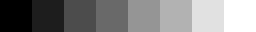

# CSE 455 Homework 1 #

Welcome friends,

For the first assignment we'll just get to know the codebase a little bit and practice manipulating images, transforming things, breaking stuff, it should be fun!

## Image basics ##

We have a pretty basic datastructure to store images in our library. The `image` struct stores the image metadata like width, height, and number of channels. It also contains the image data stored as a floating point array. You can check it out in `src/image.h`, it looks like this:

    typedef struct{
        int h,w,c;
        float *data;
    } image;

We have also provided some functions for loading and saving images. Use the function:

    image im = load_image("image.jpg");

to load a new image. To save an image use:

    save_image(im, "output");

which will save the image as `output.jpg`. If you want to make a new image with dimensions Width x Height x Channels you can call:

    image im = make_image(w,h,c);

You should also use: 

    free_image(im);

when you are done with an image. So it goes away. You can check out how all this is implemented in `src/load_image.c`. You probably shouldn't change anything in this file. We use the `stb_image` libary for the actual loading and saving of jpgs because that is, like, REALLY complicated. I think. I've never tried. Anywho....

You'll be modifying the file `process_image.c`.

## Getting and setting pixels ##

The most basic operation we want to do is change the pixels in an image. As we talked about in class, we represent an image as a 3 dimensional tensor. We have spatial information as well as multiple channels which combine together to form a color image:

The convention is that the coordinate system starts at the top left of the image, like so:

In our `data` array we store the image in `CHW` format. The first pixel in data is at channel 0, row 0, column 0. The next pixel is channel 0, row 0, column 1, then channel 0, row 0, column 2, etc.

Your first task is to fill out these two functions in `process_image.c`:

    float get_pixel(image im, int x, int y, int c);
    void set_pixel(image im, int x, int y, int c, float v);

`get_pixel` should return the pixel value at column `x`, row `y`, and channel `c`. `set_pixel` should set the pixel to the value `v`. You will need to do bounds checking to make sure the coordinates are valid for the image. `set_pixel` should simply return without doing anything if you pass in invalid coordinates. For `get_pixel` we will perform padding to the image. There are a number of possible padding strategies:

We will use the `clamp` padding strategy. This means that if the programmer asks for a pixel at column -3, use column 0, or if they ask for column 300 and the image is only 256x256 you will use column 255 (because of zero-based indexing).

## Copying images ##

Sometimes you have an image and you want to copy it! To do this we should make a new image of the same size and then fill in the data array in the new image. You could do this by getting and setting pixels, by looping over the whole array and just copying the floats (pop quiz: if the image is 256x256x3, how many total pixels are there?), or by using the built-in memory copying function `memcpy`.

Fill in the function `image copy_image(image im)` in `process_image.c` with your code.

## Grayscale image ##

Now let's start messing with some images! People like making images grayscale. It makes them look... old? Or something? Let's do it.

Remember how humans don't see all colors equally? Here's the chart to remind you:

This actually makes a huge difference in practice. Here's a colorbar we may want to convert:

If we convert it using an equally weighted mean K = (R+G+B)/3 we get a conversion that doesn't match our perceptions of the given colors:

Instead we are going to use a weighted sum. Now, there are a few ways to do this. If we wanted the most accurate conversion it would take a fair amount of work. sRGB uses [gamma compression][1] so we would first want to convert the color to linear RGB and then calculate [relative luminance](https://en.wikipedia.org/wiki/Relative_luminance).

But we don't care about being toooo accurate so we'll just do the quick and easy version instead. Video engineers use a calculation called [luma][2] to find an approximation of perceptual intensity when encoding video signal, we'll use that to convert our image to grayscale. It operates directly on the gamma compressed sRGB values that we already have! We simply perform a weighted sum:

    Y' = 0.299 R' + 0.587 G' + .114 B'

Using this conversion technique we get a pretty good grayscale image! Now it looks like this:

Implement this conversion for the function `rgb_to_grayscale`. Return a new image that is the same size but only one channel containing the calculated luma values.

[1]: https://en.wikipedia.org/wiki/SRGB#The_sRGB_transfer_function_("gamma")
[2]: https://en.wikipedia.org/wiki/Luma_(video)
